<!-- B73 profile portfolio. All artwork is repository-local; no tracking widgets. -->

  <a href="https://b73.dev">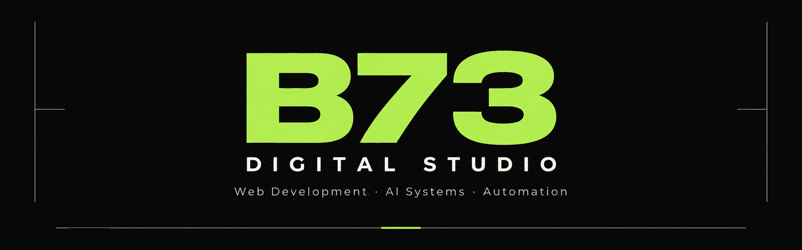</a>

  <a href="https://b73.dev"><strong>Visit B73 ↗</strong></a>
  &nbsp; · &nbsp;
  <a href="https://github.com/fatihex3/b73-lead-radar"><strong>View Lead Radar ↗</strong></a>

<a href="./assets/b73-hero.png">Static banner</a>

 

## 01 / About

**B73 is my web and software studio.**

I build business websites, landing pages and WordPress experiences, with a focus on frontend development and accessibility improvements. My software work spans internal tools, API integrations and AI systems.

**Build useful products without unnecessary complexity.**

 

## 02 / Featured systems

<a href="https://github.com/fatihex3/b73-lead-radar">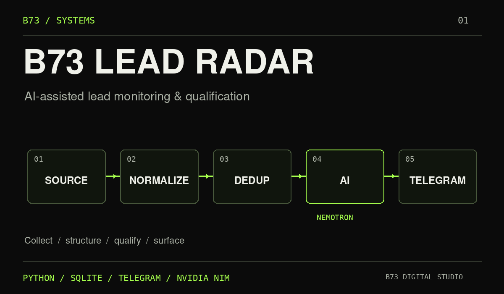</a>

### B73 Lead Radar

AI-assisted lead monitoring and qualification system.

- Structured opportunity collection
- Duplicate-safe ingestion
- Buyer-intent qualification
- Nemotron scoring
- Telegram operator workflow

`Python` · `SQLite` · `Telegram` · `NVIDIA NIM` · `Nemotron`

[View repository ↗](https://github.com/fatihex3/b73-lead-radar)

 

<table>
  <tr>
    <td width="50%" valign="top">
      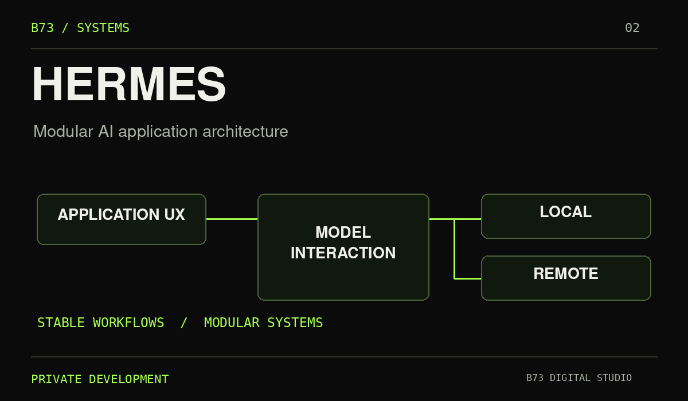
      <h3>HERMES</h3>
      
<strong>Private Development</strong>

      
Private experimental AI system focused on modular AI application architecture, model interaction and stable workflows.

      
Application UX · Local and remote AI workflows

    </td>
    <td width="50%" valign="top">
      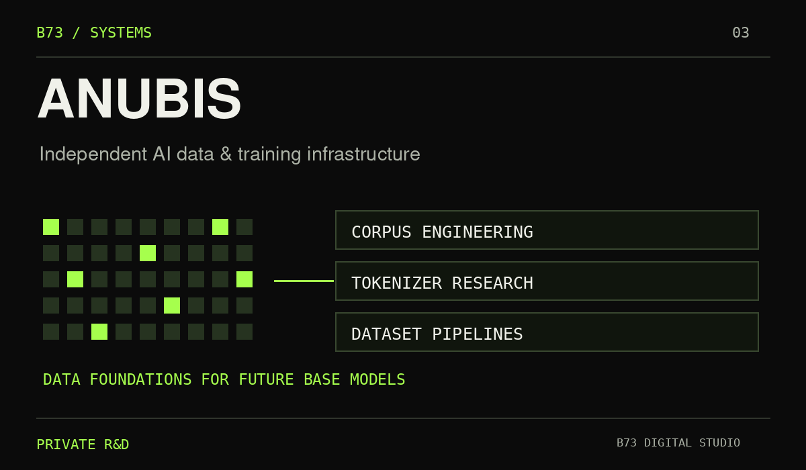
      <h3>ANUBIS</h3>
      
<strong>Private R&amp;D</strong>

      
Private AI infrastructure and data project focused on corpus engineering, dataset pipelines and future base-model development.

      
Corpus preparation · Tokenizer research · Model training infrastructure

    </td>
  </tr>
</table>

HERMES and ANUBIS are independent projects. Their models and pipelines are separate.

 

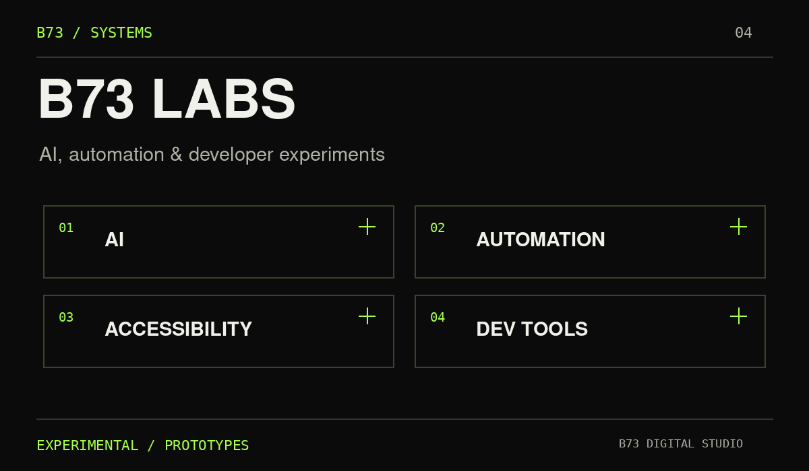

### B73 Labs

Experimental work across AI, automation, accessibility and developer tooling.

Internal tools, model experiments and prototypes.

 

## 03 / Selected web work

<table>
  <tr>
    <td width="50%" valign="top">
      <a href="https://b73.dev">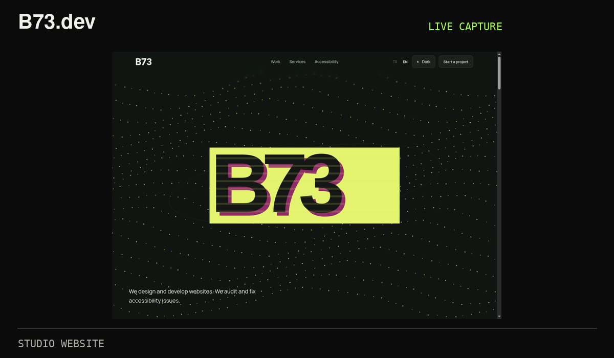</a>
      <h3><a href="https://b73.dev">B73.dev ↗</a></h3>
      
Studio website &amp; portfolio

      
<strong>Live</strong> · Live site capture

    </td>
    <td width="50%" valign="top">
      <a href="https://ebaysal.com">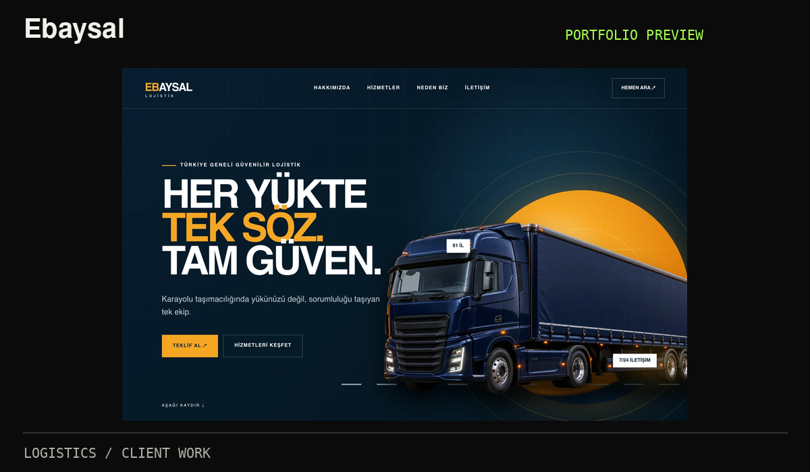</a>
      <h3><a href="https://ebaysal.com">Ebaysal ↗</a></h3>
      
Logistics · WordPress

      
<strong>Client work</strong> · Portfolio preview

    </td>
  </tr>
  <tr>
    <td width="50%" valign="top">
      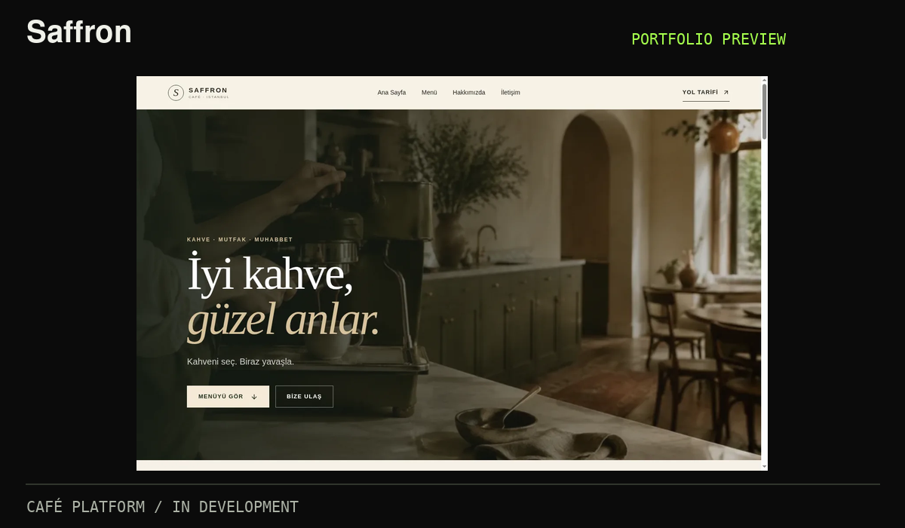
      <h3>Saffron</h3>
      
Café website &amp; digital menu

      
<strong>In development</strong> · Portfolio preview

    </td>
    <td width="50%" valign="top">
      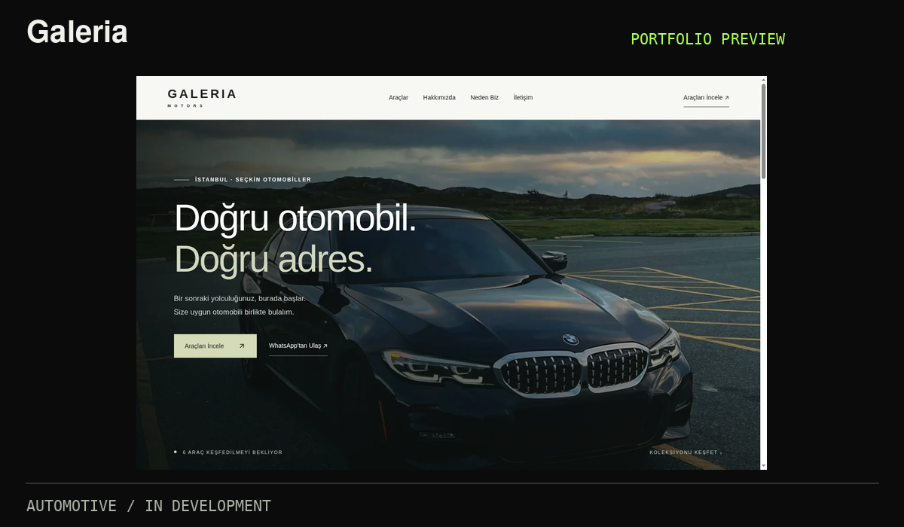
      <h3>Galeria</h3>
      
Automotive showroom &amp; inventory

      
<strong>In development</strong> · Portfolio preview

    </td>
  </tr>
  <tr>
    <td width="50%" valign="top">
      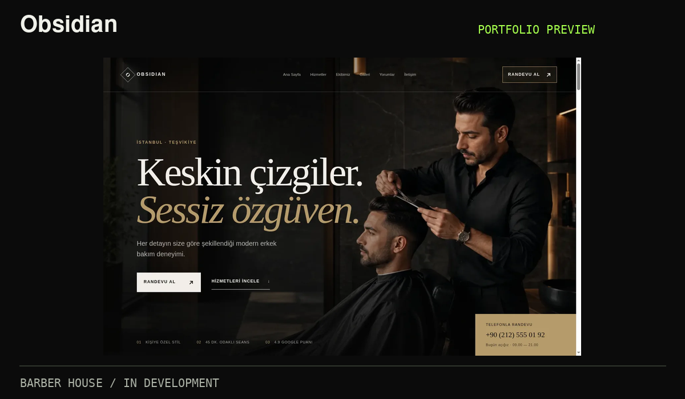
      <h3>Obsidian</h3>
      
Barber house website

      
<strong>In development</strong> · Portfolio preview

    </td>
    <td width="50%" valign="top">
      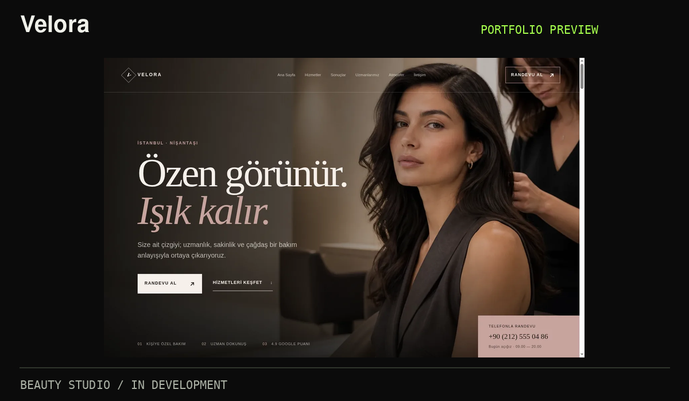
      <h3>Velora</h3>
      
Beauty studio web experience

      
<strong>In development</strong> · Portfolio preview

    </td>
  </tr>
</table>

The five project previews are sourced from the [B73 portfolio](https://b73.dev/en/work). They represent the published portfolio visuals; development projects are identified above.

 

## 04 / What I build

### Web

Business Websites · Landing Pages · WordPress · Responsive Interfaces · Frontend Development · Accessibility Improvements

### Software

Python Tools · Telegram Bots · API Integrations · Data Pipelines · Automation · Internal Systems

### AI

LLM Integrations · NVIDIA NIM · Nemotron · AI Workflows · Corpus Engineering · Model Experiments

 

## 05 / Tech stack

  
  
  
  
  
  
  
  

 

## 06 / Engineering principles

1. Reliability before complexity
2. Clear systems before clever systems
3. Measure before optimizing
4. Keep ownership and infrastructure understandable
5. Ship → test → improve
6. AI is a tool, not an excuse for bad engineering

 

## 07 / Current projects

- **B73 Digital Studio** — Business websites, frontend and accessibility improvements.
- **B73 Lead Radar** — Lead monitoring, qualification and operator workflows.
- **HERMES** — AI application architecture. *Private Development.*
- **ANUBIS** — Independent AI data infrastructure. *Private R&amp;D.*
- **B73 Labs** — AI experiments, automation and internal tools.

 

## 08 / Contact

  <h2>B73 DIGITAL STUDIO</h2>
  
Web Development · AI Systems · Automation

  
<a href="https://b73.dev"><strong>b73.dev ↗</strong></a> &nbsp; · &nbsp; <a href="https://github.com/fatihex3">github.com/fatihex3 ↗</a>

  
Türkiye

